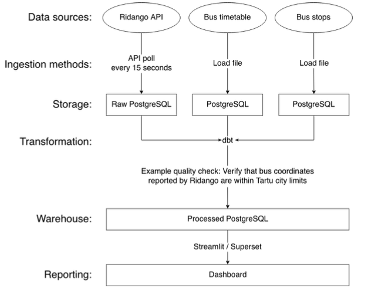
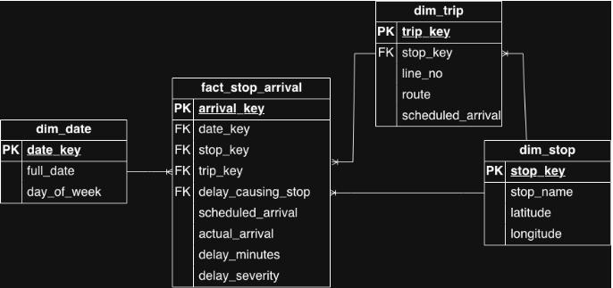

# Tartu Bus Delays — Data Engineering Project

**Group 18** — Data Architecture & Modeling

## Project Member Roles and Contributions

- Daiva Babi — attended the project plan discussion meeting (25%)
- Peep Kolberg — attended the project plan discussion meeting (25%)
- Inga Tallinn — attended the project plan discussion meeting (25%)
- Tiina Uuk — attended the project plan discussion meeting (25%)

## Business Brief

The goal of the project is to build a dashboard for monitoring real-time bus operations in Tartu and analyze delays in the bus service.

The main stakeholders of the project are the **City of Tartu**, **public transportation operators**, and **public transportation users**.

## KPIs

1. Average schedule delay (minutes), aggregated by bus line, date, and hour of day
2. Percentage of bus trips with a severe delay (6+ min), by bus line
3. Percentage of stop arrivals on time (up to 1 min delay), by bus line

## Business Questions

Our model answers the following business questions:

1. What percentage of arrivals to a stop are either on time (up to 1 min delay), moderately delayed (2–5 min) or severely delayed (6+ min)?
2. Which bus lines have the highest proportion of delays?
3. Which bus stops have the highest proportion of delays?
4. At what time of the day and day of the week are delays most frequent?
5. How does the reliability of the service change over time?

## Datasets

We use three external data sources and construct one derived dataset:

1. **Tartu bus timetable** (122k rows, 11 columns). Contains scheduled trips and stop arrival times. Provides the expected service schedule against which observed bus operations will be compared.
2. **Tartu bus stops**. Contains bus-stop identifiers, names and coordinates. Coordinates are used together with GPS observations to detect bus arrivals at stops.
3. **Ridango real-time bus data**. The Ridango API provides near-real-time observations of buses currently operating in Tartu, including bus line, bus and trip IDs, trip start time and date, observation time, and GPS coordinates. The API is queried every 15 seconds and observations are stored to build a dataset of observations.
4. **Derived stop-arrival dataset** (will grow to 1000+ rows, 8 columns). Real-time observations are combined with the timetable and stop locations to detect stop-arrival events. Each event contains line, trip, stop, scheduled arrival, actual arrival, calculated schedule delay, delay severity, and delay-causing stop. This dataset forms the basis of the analytical fact table and dashboard metrics.

## Tooling

- **Airflow** — orchestrates the data pipeline, periodically retrieves Ridango API data and triggers downstream processing tasks.
- **PostgreSQL** — stores collected data and implements the analytical star schema.
- **dbt** — transforms raw data into the dimensional model and performs data quality tests.
- **Streamlit or Superset** — final dashboard and visualization of the KPIs (decision to be made after the respective practice session).
- **Docker** — everything runs in Docker for reproducibility.

## Data Architecture



Pipeline stages:

1. **Data sources** — Ridango API, Bus timetable, Bus stops
2. **Ingestion methods** — API poll every 15 seconds; load file for timetable and stops
3. **Storage** — Raw PostgreSQL (Ridango), PostgreSQL (timetable, stops)
4. **Transformation** — dbt (with quality checks, e.g. verify that bus coordinates reported by Ridango are within Tartu city limits)
5. **Warehouse** — Processed PostgreSQL
6. **Reporting** — Dashboard (Streamlit / Superset)

## Data Model

Star schema with one fact table and three dimension tables:

- **fact_stop_arrival** — `arrival_key`, `date_key`, `stop_key`, `trip_key`, `delay_causing_stop`, `scheduled_arrival`, `actual_arrival`, `delay_minutes`, `delay_severity`
- **dim_date** — `date_key`, `full_date`, `day_of_week`
- **dim_stop** — `stop_key`, `stop_name`, `latitude`, `longitude`
- **dim_trip** — `trip_key`, `stop_key`, `line_no`, `route`, `scheduled_arrival`



### Sample query — delay categories

```sql
SELECT
    delay_severity,
    COUNT(*) AS arrival_count,
    ROUND(100.0 * COUNT(*) / SUM(COUNT(*)) OVER (), 2) AS percentage
FROM fact_stop_arrival
GROUP BY delay_severity
ORDER BY percentage DESC;
```

## Repository Structure

## Repository Structure

| Path | Description |
|---|---|
| [`ddl/`](ddl/) | DDL scripts — star schema creation |
| [`ddl/01_create_dim_tables.sql`](ddl/01_create_dim_tables.sql) | Dimension tables: `dim_date`, `dim_stop`, `dim_trip` |
| [`ddl/02_create_fact_table.sql`](ddl/02_create_fact_table.sql) | Fact table: `fact_stop_arrival` with indexes |
| [`dml/`](dml/) | DML scripts — sample data |
| [`dml/01_sample_dim_data.sql`](dml/01_sample_dim_data.sql) | Sample rows for dimension tables |
| [`dml/02_sample_fact_data.sql`](dml/02_sample_fact_data.sql) | Sample rows for fact table |
| [`queries/`](queries/) | SQL answering the 5 business questions |
| [`queries/01_delay_categories.sql`](queries/01_delay_categories.sql) | Q1: distribution of arrivals by delay category |
| [`queries/02_delays_by_line.sql`](queries/02_delays_by_line.sql) | Q2: delays by bus line |
| [`queries/03_delays_by_stop.sql`](queries/03_delays_by_stop.sql) | Q3: delays by bus stop |
| [`queries/04_delays_by_time.sql`](queries/04_delays_by_time.sql) | Q4: delays by time of day / weekday |
| [`queries/05_reliability_over_time.sql`](queries/05_reliability_over_time.sql) | Q5: reliability trend over time |
| [`docs/`](docs/) | Architecture and schema diagrams |

## How to Run

```bash
psql -d tartu_bus -f ddl/01_create_dim_tables.sql
psql -d tartu_bus -f ddl/02_create_fact_table.sql
psql -d tartu_bus -f dml/01_sample_dim_data.sql
psql -d tartu_bus -f dml/02_sample_fact_data.sql
psql -d tartu_bus -f queries/01_delay_categories.sql
```
